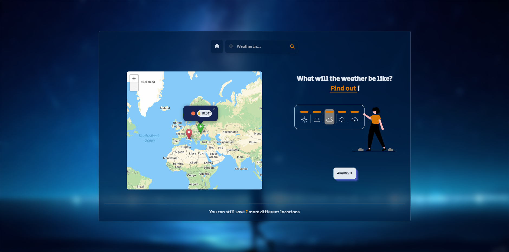

# weather-app

## Table of contents

- [Overview](#overview)
  - [Screenshot](#screenshot)
  - [Features](#features)
  - [Links](#links)
- [My process](#my-process)
  - [Built with](#built-with)
  - [Implementation](#implementation)
  - [Known issues](#known-issues)
  - [Useful resources](#useful-resources)
- [Author](#author)

## Overview

### Screenshot

### Links

- [Live Site Demo](https://weather-app-javascript-mariushor.netlify.app/)
- [Code Repository](https://github.com/MariusHor/weather-app)

### Features

- Search for weather reports by location name or by clicking on the world map
- The weather report shows both the current weather and an up to 24 hour forecast
- An interactive map that can be clicked to trigger new location search
- The map can display different weather markers for Current location, Favorite locations or Current click location
- Save current location if wanted
- Save up to 8 favorite locations
- Copy and share the weather report url
- Clear and concise error handling

## My process

### Built with

- Semantic HTML5 markup
- SCSS
- JavaScript
- LeafletJs
- MomentJs
- Webpack
- NodeJS
- ExpressJS
- Tailwind
- FontAwesome
- Netlify and Render for deployment

### Implementation

To ensure the security of API keys used for this weather app, I created a simple server API with NodeJS and ExpressJS. The client fetches data from this API, with the App component acting as a controller, receiving actions from the views and communicating with the Model to set its state based on the information received from the views. State dispatches from the Model are then triggered to the listening views.

To promote more decoupled components, the required classes are instantiated inside the index.js file, and dependencies needed for each module were injected instead of doing so inside the classes. This follows the Dependency Injection design pattern. The Observer pattern is used to communicate state updates from the Model to the Views. A PubSub-like event class registers new events and listeners, dispatching data to the listeners of events. To store the listeners, a Map was used instead of an array or object, as it performs better in scenarios involving frequent additions and removals of key-value pairs.

Weather data is retrieved from the OpenWeatherMap API, and the map tiles are obtained from the MapTiler API. The map is implemented through the LeafletJS library, allowing users to obtain weather reports based on their click coordinates. The Geolocation API is used to permit users to set a current location, which triggers a home marker to be displayed on the map if location permission is granted.

Users can favorite up to 8 locations and they can also copy and share the current report url. This feature was implemented using window.location and window.history. Whenever the report view gets activated by a user search or map click, the URL gets updated with the correct path. If an error occurs, the app displays an error view, allowing the user to receive information and return to the home view, where they can start searching for a new location and get a new weather report.

For the deployment of the app I have used Netlify for the client side and Render for the server side.

### Known issues

A pretty big issue with this project is the fact that as I am dynamically switching between views, I am basically removing certain DOM nodes and inserting other ones constantly so it is very important to remember to remove listeners and to not leave references to the removed nodes inside the app. As of right now the app might present certain memory leaks because of this exact issue so I want to note and remember to either try to rewrite parts of this app hoping that I can solve the problem or I will ever tackle a similar project in Javascript in the future to make sure that I implement things correctly and that I test for memory leaks from the start.

### Useful resources

- [MDN Javascript documentation](https://developer.mozilla.org/en-US/docs/Web/JavaScript)
- [LeafletJs documentation](https://leafletjs.com/reference.html)
- [MomentJs documentation](https://momentjs.com/docs/)
- [ExpressJs documentation](https://expressjs.com/)
- [Tailwind documentation](https://tailwindcss.com/docs/installation)
- [Webpack documentation](https://webpack.js.org/concepts/)
- [OpenWeatherMap API documentation](https://openweathermap.org/api)
- [FontAwesome documentation](https://fontawesome.com/docs)

## Author

- Github - [@MariusHor](https://github.com/MariusHor/)
- Frontend Mentor - [@MariusHor](https://www.frontendmentor.io/profile/MariusHor)
